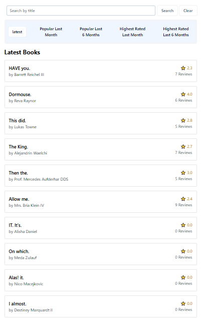

<p align="center">
  <a href="https://laravel.com" target="_blank">
    
  </a>
</p>

<p align="center">
  
  
  
  
</p>

---

# 📚 Book Review Portal

A **Laravel-based Book Review Portal** where users can browse books, view details, and explore reader reviews dynamically.  
This project demonstrates practical use of **Eloquent ORM**, **database seeding**, **query optimization with `when()`**, and **relationship handling (`hasMany`)** in Laravel.

---

## 🚀 Features

- 📘 List all books dynamically from the database  
- 🧠 Display each book with author and reviews  
- 🧩 Uses `with()` for eager loading to optimize queries  
- 🔍 Dynamic filtering using the `when()` query method  
- 🧰 Seeder integration with `Faker` for dummy data  
- ⚙️ Modern MVC structure following Laravel best practices  
- 🧾 Clean and minimal front-end with Blade templates  


## 🖼️ Screenshots
> All screenshots are stored in the `/screenshots` folder.

### 🔍 Search by Title


### 🏠 Home Page (Latest Books)


### 🌟 Popular Last Month


### 📅 Popular Last 6 Months


### 🏆 Highest Rated Last Month


### 🏅 Highest Rated Last 6 Months


### 📖 Single Book Review & Rating


---

## 📦 Built With

- **Laravel 12.x**
- **PHP 8.2+**
- **Bootstrap 5**
- **Blade Templates**
- **Eloquent ORM**
- **MySQL / PostgreSQL / SQLite**

---

## 🚀 Getting Started

### Clone the repository


---

## ⚙️ Installation Guide

### 1️⃣ Clone the Repository
```bash
git clone https://github.com/your-username/book_review_portal.git
cd book_review_portal


✨ Future Improvements

🔐 Add authentication (Laravel Breeze / Jetstream)

🗂 Task categories & due dates

📱 Fully responsive design

🔔 Email notifications for pending tasks


🤝 Contributing

Contributions are welcome! Feel free to open issues or submit pull requests.
Please follow the Code of Conduct
.

💡 Technologies Used

Laravel 11.x — Backend Framework

MySQL — Database

Blade — Templating Engine

TailwindCSS — Optional styling (used for layout)

Faker — Dummy data generator for seeding

🪪 License

This project is licensed under the MIT License
.

